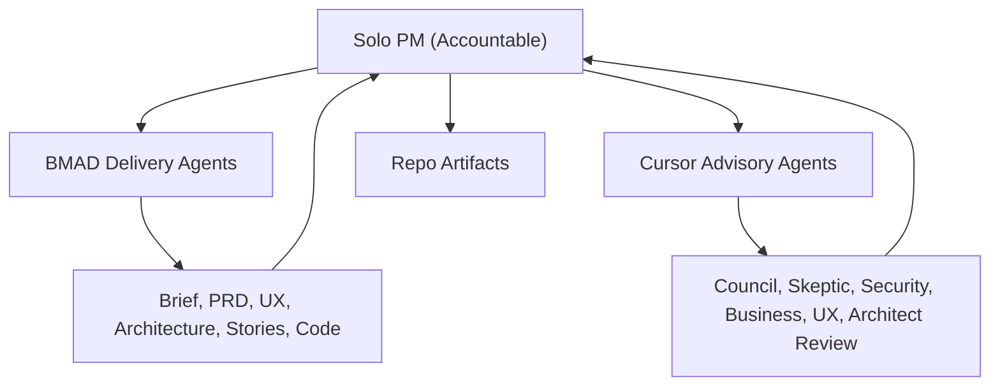

# BMAD Method Workflow cho SpeakFit English

Tài liệu này là playbook vận hành dự án **SpeakFit English — Personalized English Coach PWA** theo mô hình **Solo PM (background dev) quản lý đội AI agents** trong Cursor IDE.

Nguồn đầu vào chính hiện tại: `IDEA_BRIEF.md`. `PLANNING_QUESTIONS.md` là nguồn legacy nếu cần đối chiếu.

---

## 1. Mục tiêu & nguyên tắc nền

Mục tiêu của playbook là giúp Solo PM điều phối BMAD Method và Cursor advisory agents như một đội outsource AI chuyên nghiệp: có giao việc, nhận bàn giao, kiểm duyệt, sprint cadence, quality gates, RAID log và release discipline.

MVP của SpeakFit chỉ chứng minh daily voice coaching loop:

```text
User mở app mỗi ngày → thấy mission → nói/shadow → nhận feedback → retry → thấy progress.
```

Nguyên tắc nền:

1. **BMAD là delivery method chính.** Không skip phase từ idea sang implementation.
2. **AI execute, Solo PM decide.** AI agents soạn, review, implement, đề xuất; Solo PM chốt.
3. **Mọi artifact AI cần Solo PM approve** trước khi bước sang phase tiếp theo.
4. **Council chỉ chạy tại gate**, không tham gia mọi quyết định nhỏ.
5. **Mỗi sprint có sprint goal rõ**, không sprint nào chỉ là "làm cho hết việc".
6. **Mọi quyết định lớn phải log lại** trong `docs/decisions.md` hoặc ADR.
7. **Không tự động load nhiều persona** vào context bình thường; advisory agents chỉ chạy khi gọi rõ.

---

## 2. Mô hình Solo PM + AI Team

Solo PM là người accountable duy nhất cho sản phẩm, scope, chất lượng, merge và release. AI agents là đội thực thi và tư vấn.



Quy tắc orchestration:

- AI agent không tự gọi AI agent khác; Solo PM là người trigger.
- Council có thể điều phối nhiều góc nhìn, nhưng vẫn phải được Solo PM gọi rõ.
- AI không tự approve artifact, không tự merge, không tự release.
- Nếu AI đề xuất đổi scope, proposal đó đi vào backlog hoặc RAID; không implement ngay.

---

## 3. Phân vai AI agents

### 3.1 BMAD delivery agents

| Vai | Skill chính | Khi triệu tập | Output kỳ vọng | Cấm làm |
|---|---|---|---|---|
| Analyst / Mary | `bmad-agent-analyst`, `bmad-product-brief`, `bmad-prfaq` | Discovery, brief, research, PRFAQ | `product-brief.md`, `prfaq.md`, open questions | Không tự chốt MVP scope |
| PM / John | `bmad-agent-pm`, `bmad-create-prd`, `bmad-validate-prd`, `bmad-create-epics-and-stories`, `bmad-create-story` | PRD, epics, stories, readiness | `prd.md`, `epics-and-stories.md`, story files | Không tự đưa out-of-MVP vào sprint |
| Architect / Winston | `bmad-agent-architect`, `bmad-create-architecture`, `bmad-check-implementation-readiness` | Architecture, ADR, data model, integration | `architecture.md`, ADRs, risk list | Không tự đổi tech stack đã chốt |
| UX / Sally | `bmad-agent-ux-designer`, `bmad-create-ux-design` | UX flows, screens, states | `ux-spec.md`, interaction states | Không tự mở rộng feature ngoài PRD |
| Developer / Amelia | `bmad-agent-dev`, `bmad-dev-story`, `bmad-quick-dev`, `bmad-code-review` | Implement story, fix, verify | Code changes, test evidence, review report | Không implement story chưa Ready |
| Tech Writer / Paige | `bmad-agent-tech-writer`, docs workflows | Docs, runbooks, onboarding | Docs/runbooks/changelog drafts | Không thay đổi product decisions |

### 3.2 Cursor advisory agents

Các agents này nằm trong `.cursor/agents/` và chỉ chạy explicit-only.

| Agent | Khi dùng | Output kỳ vọng | Boundary |
|---|---|---|---|
| `grill-me` | Idea còn mơ hồ, trước council | Từng câu hỏi một + câu trả lời đề xuất | Không lập plan/build |
| `council` | Milestone review | Tổng hợp đa góc nhìn + decisions needed | Không sửa artifact |
| `product-manager` | Review user/JTBD/MVP | Persona, JTBD, MVP scope, riskiest assumption | Không thay BMAD PM |
| `architect` | Review feasibility/stack | Feasibility, modules, risk, effort | Không đổi architecture đã approve |
| `ux-designer` | Review UX flow | Journey, friction, empty state, accessibility | Không thêm feature ngoài scope |
| `security` | Review privacy/security | Data flow, threat model, minimum safeguards | Không block vô lý; nêu trade-off |
| `business` | Review GTM/pricing | Positioning, monetization, competitors | Không ép monetization vào MVP |
| `skeptic` | Phản biện scope/risk | Top failure reasons, hidden assumptions | Không công kích cá nhân |
| `optimist` | Vision/10x review | 10x/100x vision, adjacent opportunities | Không tự đưa moonshot vào MVP |

---

## 4. RACI giữa Solo PM và AI agents

A = Accountable, R = Responsible, C = Consulted, I = Informed. **Solo PM luôn là A duy nhất.**

| Artifact / Work | Responsible | Accountable | Consulted | Informed |
|---|---|---|---|---|
| Idea Brief | Analyst | Solo PM | `grill-me`, `skeptic` | Council |
| Product Brief | Analyst | Solo PM | `product-manager`, `skeptic`, `business` | Architect |
| PRFAQ | Analyst | Solo PM | `business`, `skeptic` | PM agent |
| PRD | PM agent | Solo PM | `council`, `skeptic`, `business`, `ux-designer` | Architect, UX |
| UX Spec | UX agent | Solo PM | `ux-designer`, `skeptic` | PM, Architect |
| Architecture | Architect agent | Solo PM | `architect`, `security`, `skeptic` | PM, Dev |
| Epics & Stories | PM agent | Solo PM | Architect agent, `skeptic` | Dev agent |
| Story Ready | PM agent | Solo PM | Architect/UX/Security as needed | Dev agent |
| Implementation | Dev agent | Solo PM | `bmad-code-review`, advisory agent if needed | PM agent |
| Release | Solo PM | Solo PM | Dev agent, Tech Writer | All agents |

---

## 5. AI Work Order

Solo PM giao việc cho AI bằng **AI Work Order**. Mỗi work order có một AI agent chính.

Template bắt buộc:

```md
# AI Work Order

**ID:** WO-YYYY-NNN
**Sprint:** Sprint N
**Primary Agent:** <BMAD or Cursor agent>
**Supporting Agents:** <optional>
**Goal:** <1 sentence>
**Input Artifacts:** <paths>
**Expected Output:** <paths or report>
**Acceptance Criteria:**
- [ ] ...
**Constraints:** <scope, format, length, non-goals>
**Deadline:** <date or sprint day>
**Risk Hints:** <known risks>
**Success Signal:** <what Solo PM must see to approve>
```

Rules:

- Không quá 3 work orders in-progress cùng lúc.
- Không quá 1 PRD/Architecture work order cùng lúc.
- Một work order không được vừa planning vừa implementation.
- Nếu AI phát hiện scope mới, nó phải báo cáo, không tự implement.

---

## 6. AI Artifact Contract

AI bàn giao output bằng **AI Artifact Contract** để Solo PM review.

```md
# AI Artifact Contract

**Work Order:** WO-YYYY-NNN
**Agent:** <agent>
**Artifact Path(s):** <paths>

## Summary
<5 dòng tóm tắt>

## Acceptance Criteria Checklist
- [ ] ...

## Diff / Change Summary
- ...

## Risks Found
- ...

## Open Questions for Solo PM
- ...

## Recommended Next Step
- ...
```

Rules:

- Solo PM không approve nếu thiếu acceptance checklist hoặc open questions.
- AI không tự đóng work order; chỉ submit.
- Nếu artifact ảnh hưởng scope, phải có explicit PM approval.

---

## 7. Repository & artifact structure

```text
IDEA_BRIEF.md                              # Idea source of truth
PLANNING_QUESTIONS.md                      # Legacy input / reference
BMAD_SPEAKFIT_WORKFLOW.md                  # Solo PM + AI operating playbook

_bmad-output/
  planning-artifacts/
    product-brief.md
    prfaq.md
    prd.md
    ux-spec.md
    architecture.md
    epics-and-stories.md
  implementation-artifacts/
    stories/

docs/
  adr/
  council-reviews/
  decisions.md
  onboarding/
  raid.md
  runbooks/
  sprints/
    sprint-N/
      plan.md
      work-orders/
      artifact-contracts/
      review.md
      retro.md
  templates/

.cursor/
  agents/                                  # Explicit advisory agents
  rules/                                   # Routing and BMAD boundary

.claude/
  skills/                                  # BMAD skills/customization
```

---

## 8. BMAD lifecycle phases

### Phase 0 — Discovery & Brief

- **Goal:** Biến idea thô thành product brief và PRFAQ đủ rõ.
- **Responsible:** Analyst / Mary.
- **Accountable:** Solo PM.
- **Allowed advisors:** `grill-me`, `product-manager`, `business`, `skeptic`.
- **Inputs:** `IDEA_BRIEF.md`, `PLANNING_QUESTIONS.md` nếu cần.
- **Outputs:** `_bmad-output/planning-artifacts/product-brief.md`, `prfaq.md`, `open-questions.md` nếu cần.
- **DoD:** ICP rõ, problem rõ, MVP hypothesis rõ, riskiest assumptions có trong RAID.
- **Gate:** Solo PM approval; optional `grill-me` trước khi gọi council.
- **Do not:** Không viết PRD khi problem/user còn mơ hồ.

### Phase 1 — PRD

- **Goal:** Chốt product requirements và MVP boundary.
- **Responsible:** PM / John.
- **Accountable:** Solo PM.
- **Allowed advisors:** `council`, `product-manager`, `skeptic`, `business`, `ux-designer`.
- **Inputs:** Product Brief, PRFAQ, open questions.
- **Output:** `_bmad-output/planning-artifacts/prd.md`.
- **DoD:** Vision, personas, core journey, MVP features, non-goals, success metrics, product acceptance criteria.
- **Gate:** Council Gate 1 after Product Brief / before PRD final; Solo PM signs off PRD.
- **Do not:** Không đưa payment/community/CMS/native app vào MVP trừ khi Solo PM đổi scope.

### Phase 2 — UX Specification

- **Goal:** Thiết kế UX flow đủ để implementation không đoán.
- **Responsible:** UX / Sally.
- **Accountable:** Solo PM.
- **Allowed advisors:** `ux-designer`, `skeptic`.
- **Input:** PRD.
- **Output:** `_bmad-output/planning-artifacts/ux-spec.md`.
- **DoD:** Onboarding, Daily Coach Desk, Today’s Mission, practice loop, quiet/prepare mode, recording/replay, feedback states, loading/error/empty states.
- **Gate:** Solo PM review UX spec.
- **Do not:** Không thêm feature chỉ vì UX "hay" nhưng không phục vụ MVP loop.

### Phase 3 — Architecture

- **Goal:** Chốt architecture đủ an toàn để triển khai sprint.
- **Responsible:** Architect / Winston.
- **Accountable:** Solo PM.
- **Allowed advisors:** `architect`, `security`, `skeptic`.
- **Inputs:** PRD, UX Spec.
- **Outputs:** `_bmad-output/planning-artifacts/architecture.md`, `docs/adr/*.md` nếu cần.
- **DoD:** Auth, data model, lesson/mission, practice session, recording strategy, transcript/feedback, privacy/retention, cost tracking, deployment approach.
- **Gate:** Council Gate 2 after PRD / before Architecture; Council Gate 3 after Architecture / before Sprint 1.
- **Do not:** Không chọn stack frontier nếu MVP có thể dùng stack tiêu chuẩn.

### Phase 4 — Epics & Stories

- **Goal:** Chia PRD/Architecture thành backlog có thể execute.
- **Responsible:** PM / John.
- **Accountable:** Solo PM.
- **Allowed advisors:** Architect agent, `skeptic`.
- **Inputs:** PRD, UX Spec, Architecture.
- **Outputs:** `_bmad-output/planning-artifacts/epics-and-stories.md`, story files.
- **DoD:** Mỗi story có user value, acceptance criteria, context, technical notes, dependencies, test expectations, DoR/DoD.
- **Gate:** `bmad-check-implementation-readiness`.
- **Do not:** Không tạo story implementation nếu PRD/UX/Architecture lệch nhau.

### Phase 5 — Implementation

- **Goal:** Implement từng story Ready với verification rõ.
- **Responsible:** Developer / Amelia.
- **Accountable:** Solo PM.
- **Allowed advisors:** `bmad-code-review`, targeted Cursor advisory agent if needed.
- **Inputs:** Ready story, architecture, UX spec.
- **Outputs:** Code changes, tests/verification, artifact contract.
- **DoD:** Acceptance criteria pass, lint/typecheck/test pass nếu có, no core flow regression, Solo PM approve.
- **Gate:** AI Artifact Gate per work order; Release Gate before production.
- **Do not:** Không implement story chưa Ready hoặc out-of-MVP proposal.

---

## 9. Sprint operating model cho AI team

Sprint có thể dài 1 tuần nếu Solo PM có thời gian, hoặc 2 tuần nếu bận. Default: 1 tuần cho planning/early MVP, 2 tuần cho implementation lớn.

### Sprint Planning

- Solo PM chọn sprint goal.
- Chỉ pick stories/work orders có input rõ.
- Tạo `docs/sprints/sprint-N/plan.md`.
- Tạo work orders trong `docs/sprints/sprint-N/work-orders/`.

### Daily Check-in async

Mỗi ngày dưới 15 phút:

- Xem AI artifacts đang chờ review.
- Approve / request changes / reject.
- Update RAID nếu có risk/issue mới.
- Không mở thêm work order nếu WIP đã quá 3.

### Mid-sprint correction

- Nếu AI drift khỏi scope: dùng `bmad-correct-course`.
- Có thể cancel work order.
- Log quyết định vào sprint plan hoặc `docs/decisions.md`.

### Sprint Review

- Solo PM kiểm tra sprint goal.
- Demo cho chính mình hoặc người dùng thật nếu có.
- Output: `docs/sprints/sprint-N/review.md`.

### Retrospective

- Dùng `bmad-retrospective`.
- Câu hỏi trọng tâm:
  - Agent nào hoạt động tốt?
  - Agent nào drift hoặc tạo overhead?
  - Work order nào viết chưa rõ?
  - Sprint sau cần đổi prompt/rule/gate gì?
- Output: `docs/sprints/sprint-N/retro.md`.

### Backlog grooming

- Đẩy story từ Backlog → Ready nếu pass DoR.
- Tách story quá lớn.
- Defer out-of-MVP.

WIP limit:

- Tối đa 3 work orders in-progress.
- Tối đa 1 PRD/Architecture work order in-progress.
- Tối đa 1 implementation story phức tạp in review.

---

## 10. Story lifecycle & AI hand-off

```text
Backlog → Ready → In Progress → AI Submitted → PM Review → Done → Released
```

| State | Owner | Entry criteria | Exit criteria |
|---|---|---|---|
| Backlog | Solo PM / PM agent | Idea or requirement exists | Story refined enough for DoR |
| Ready | Solo PM | DoR pass | Work order created |
| In Progress | Assigned AI agent | Work order accepted | Artifact contract submitted |
| AI Submitted | AI agent | Output produced | Solo PM starts review |
| PM Review | Solo PM | Artifact contract complete | Approve / request changes / reject |
| Done | Solo PM | DoD pass | Included in release candidate |
| Released | Solo PM | Release gate pass | Production smoke test pass |

---

## 11. Git/PR workflow tối giản cho Solo dev

Branching:

```text
main                      # protected stable branch
feature/<sprint>-<story>-<short>
hotfix/<short>
release/x.y.z             # optional for milestone release
```

PR discipline:

- Mỗi PR gắn 1 story hoặc 1 work order.
- PR description dùng `docs/templates/pr-template.md`.
- Solo PM tự review trước khi merge.
- Có thể gọi `bmad-code-review` hoặc `skeptic` cho PR rủi ro.
- CI bắt buộc nếu project có: lint, typecheck, test, build.
- Commit convention: `feat:`, `fix:`, `docs:`, `chore:`, `refactor:`, `test:`, `perf:`.

Merge rule:

- Chỉ merge khi DoD pass.
- Không merge nếu còn unresolved risk nghiêm trọng trong RAID.
- Không commit/merge nếu Solo PM chưa yêu cầu rõ.

---

## 12. Quality gates

### Definition of Ready

Một story chỉ Ready khi:

```text
- User value rõ
- Acceptance criteria rõ
- UX state đủ rõ
- Data/API impact rõ
- Privacy impact nếu có audio/user data
- Test/verification rõ
- Dependencies rõ
- Story fits MVP scope
- Estimate hoặc effort đã ước lượng
- Không còn dependency blocker
```

### Definition of Done

Một story chỉ Done khi:

```text
- Acceptance criteria pass
- Không phá core flow
- Loading/error/empty state phù hợp
- Verification/test pass
- Lint/typecheck/test pass nếu project có lệnh
- Telemetry/event tracking cập nhật nếu story ảnh hưởng metric
- Story status được cập nhật
- Tech debt/risk note vào RAID nếu có
- Solo PM approve artifact contract
```

### AI Artifact Gate

- Mỗi work order phải submit artifact contract.
- Solo PM approve/reject/request changes.
- Không artifact nào tự bước sang phase sau.

### Council Gate

- Dùng tại milestone, không dùng daily.
- Output đi vào `docs/council-reviews/`.
- Solo PM accept/defer/reject từng recommendation.

### Release Gate

- Regression checklist pass.
- Smoke test pass.
- Rollback plan rõ.
- Solo PM sign-off.

---

## 13. Council/advisory gate calendar

Dùng `council` tại 4 thời điểm:

```text
1. Sau Product Brief / trước PRD final
2. Sau PRD / trước Architecture
3. Sau Architecture / trước Sprint 1 implementation
4. Trước MVP release
```

Format yêu cầu council:

```md
Hãy review artifact X cho SpeakFit.

Artifact: <path + version>
Context: <brief>
Advisor list: PM, architect, UX, security, business, skeptic
Questions:
1. ...
2. ...
3. ...
Output: điểm đồng thuận, rủi ro, scope creep, quyết định cần Solo PM chốt, recommendation.
```

Council không tự thay đổi artifact. Solo PM ghi decision vào `docs/council-reviews/<gate>.md`.

---

## 14. RAID log AI-aware

File: `docs/raid.md`.

Mỗi entry gồm:

```text
ID | Type | Description | Owner | Priority | Mitigation / Next Step | Status | Last Updated
```

Types:

- Risk
- Assumption
- Issue
- Dependency

AI-specific risks cần track:

- AI hallucination: artifact sai sự thật hoặc bịa constraint.
- Context drift: agent quên scope hoặc quyết định cũ.
- Scope creep: AI tự thêm feature ngoài MVP.
- Tech debt: AI dùng pattern không phù hợp.
- Cost/usage: chi phí AI service hoặc TTS/STT vượt dự kiến.

Review RAID mỗi sprint review.

---

## 15. Release management cho Solo PM

Cadence: release theo milestone MVP, không cần release mỗi sprint nếu chưa có user.

Release flow:

1. Solo PM tạo release candidate.
2. Chạy regression checklist `docs/runbooks/release-qa.md`.
3. Deploy staging.
4. Chạy smoke test `docs/runbooks/smoke-test.md`.
5. Solo PM sign-off staging.
6. Deploy production.
7. Smoke test production.
8. Tag release.
9. Cập nhật `CHANGELOG.md` hoặc release notes.
10. Ghi rollback plan.

Hotfix:

- Branch `hotfix/<short>` từ `main`.
- Scope nhỏ, chỉ fix lỗi production.
- Sau hotfix, back-merge vào active branch nếu có.

---

## 16. Onboarding khi mở rộng

File `docs/onboarding/dev.md` phục vụ khi thêm dev người hoặc AI agent mới.

Nội dung tối thiểu:

- Repo structure.
- Cách đọc `BMAD_SPEAKFIT_WORKFLOW.md`.
- Cách dùng BMAD skills.
- Cách dùng `.cursor/agents`.
- Cách tạo AI Work Order.
- Cách review AI Artifact Contract.
- Cách pick story đầu tiên.
- Decision rule: mọi quyết định scope/merge/release hỏi Solo PM.

Mục tiêu: người/agent mới có thể tạo đóng góp đầu tiên trong tuần đầu mà không phá workflow.

---

## 17. Anti-scope-creep với AI

MVP không bao gồm:

- Payment/subscription.
- Community.
- Tutor marketplace.
- YouTube shadowing.
- Native app.
- Full CMS.
- Full pronunciation scoring phoneme-level.
- Multi-profile đầy đủ.
- Enterprise/B2B admin.
- Dashboard nhiều chart.

Rules:

- Mỗi feature mới do AI đề xuất phải đi qua `skeptic` hoặc PM review trước khi vào backlog.
- Backlog nên phân loại `is-mvp` hoặc `out-of-mvp`.
- Out-of-MVP không được implement trước MVP release.
- Nếu AI tự thêm feature ngoài acceptance criteria, reject hoặc tách thành backlog item.

---

## 18. Operating principles cho Solo PM quản lý AI

```text
AI execute, PM decide.
AI không tự release.
AI không tự thay đổi scope.
AI không tự đổi infra.
AI không tự gọi AI khác.
Mỗi quyết định lớn phải có ADR hoặc decision log.
Mỗi sprint phải có sprint goal.
Mỗi work order chỉ một AI chủ trì.
Council chỉ tại gate.
Solo PM là Accountable duy nhất.
```

Nếu không chắc bước tiếp theo:

```text
Dùng bmad-help và hỏi: Tôi đang ở bước nào, tiếp theo nên chạy skill nào?
```
